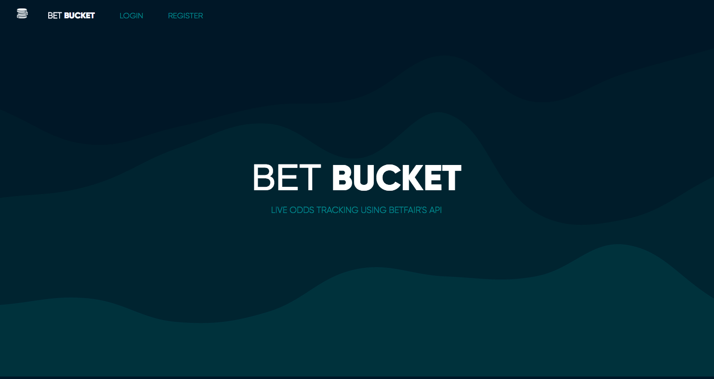
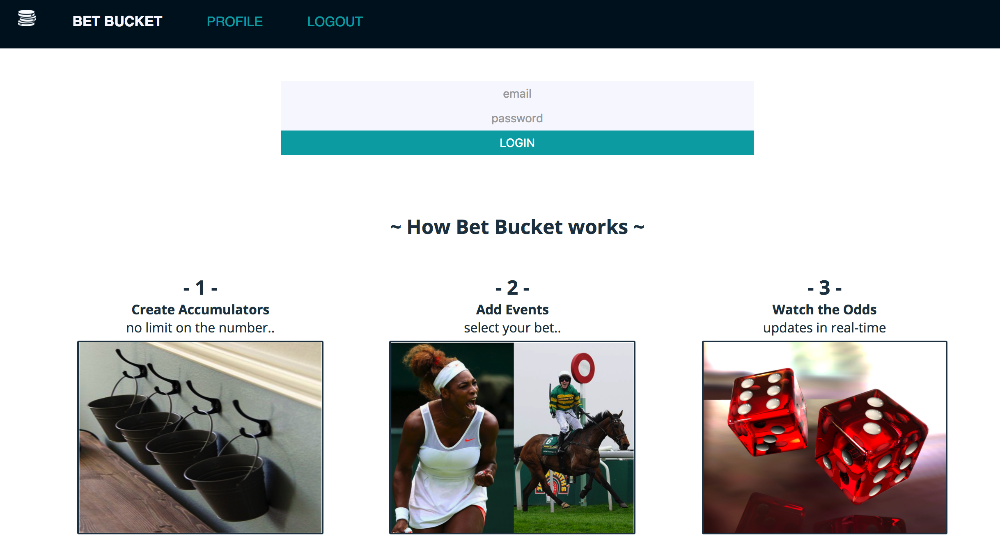
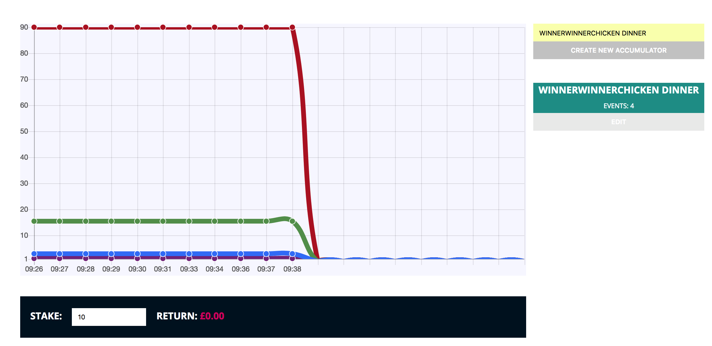
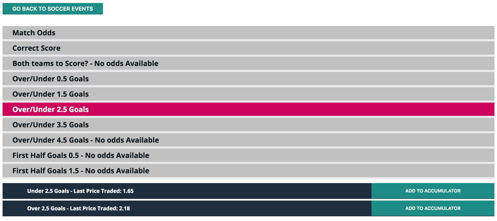
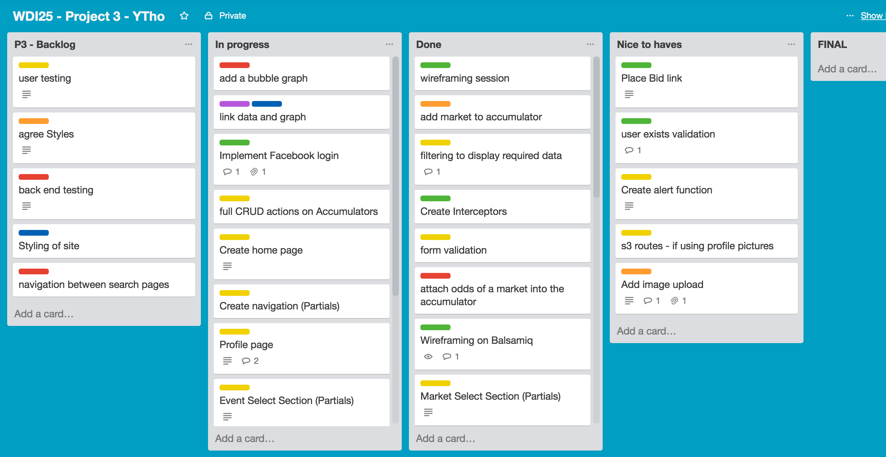

# Project 3
Team Ytho: Fabricio Ferreira, Sam Wakefield, Roman Stankiewicz, Ben Currie

# Bet Bucket - Accumulator App

### GA WDI London - Project 3 - Team Project

#### An application for obtaining betting data with which to build accumulators.  Betting odds are tracked in real time.  

The site is aimed at Users that take their gambling seriously and want to maximise potential income from an accumulator bet, based on the timing of when they place their bet.

The app is designed to enable a user to obtain information on sporting and 'special' events by category, event and outcome and build an accumulator bet with that data.  The ability to add a stake allows Users to balance the risk and likely return to maximise their gains should the accumulator win.  The API used is provided by Betfair.

The accumulator can hold any number of events, and the data will automatically update a live graph which tracks the odds.

[Link to App](https://bet-bucket.herokuapp.com/)

#### Home Screen

The landing page is simple, showing a route to login and a brief description of the app.

1. Create accumulator
2. Add events
3. Track odds

From this page, users must login and authenticate by registering through the app directly.

#### Profile page

The profile page is the main single page which is accessible only by the user that created it.  It shows a side panel with all accumulators which the user owns. The main view builds out depending on the activity being carried out with the accumulator, by the user.

#### Add Events to an Accumulator

The user clicks on the Accumulator to make it active. They  click 'add event' and start their search to find an Event Type.

Event Types available are:

* Soccer
* Tennis
* Golf
* Cricket
* Rugby
* Boxing
* Horse
* Motor
* ESports
* Special

Once an Event Type is selected, the individual event is searched for.  This could include a competition such as Champions League in Soccer or Grand National in Horses for example.  There are also special events which cater for elections, reality tv show outcomes and awards winners for example.

Once the individual event is selected, the user can drill down to the specific outcome which they require odds for.  A final click on this and the event outcome and odds are added to the accumulator bucket.

#### Viewing the Accumulator

Once the accumulator is populated the user can view the progress of the odds to maximise the payout they might win.  The API is called at 1 second intervals and while the odds update automatically per line item, so too does the graph to give a visual representation of the trend of the odds.

The graph automatically shows when an accumulator is selected and starts its updates once the user is logged in and an accumulator is selected. See Graph above as an example.

#### Approach / How It Works

This is a full stack application which utilises RESTful routing and authentication.

Secure routes ensure that only registered users can access the site.

The API is key to the functionality of the app.  It calls data constantly to maintain the correct odds, providing the data to update the graphs at a rate of once every second.

Angular charts provides real time charting capability.

##### APIs used

1. Betfair Betting API
2. Internal API - for users and accumulators

#### The Build

The following tools are used to build the site.

* Javascript
* AngularJS
* SCSS
* Charts.js
* MongoDB

Dependencies:

* angular-chart.js
* Bcrypt
* bluebird
* body-parser
* Express
* JSONwebtoken
* mongoose
* morgan
* request
* request-promise

In addition, the following planning and management tools were used:

**Trello for project management**

Trello allowed for detailed planning and allocation of tasks.  Bi-daily updates were made to progress activity and ensure that all outstanding were completed by an agreed time.

Trello was a key component of our project management capability.

**Balsamiq for wireframing**

Balsamiq helped us to plan out the views correctly, along with the flow.  While this is a compact site, there is a lot of data behind the scenes, which is available to the app, so visualising this correctly was crucial.

#### Problems & Challenges

The greatest challenges were:

1. Accessing the API as initially, acquiring and then storing the session token proved problematic but we stored it in a global variable which allowed us to send it with each of our API requests
2. Making sense of the API documentation which was complicated and assumed higher than a beginners knowledge of programming and gambling. Although this was stressful at times, it was very worthwhile as I'm sure this won't be the last time we wrestle with unclear documentation.
3. Identifying the correct filters and data sets to make the data meaningful to a user.
4. Making numerous requests to the Betfair API whilst storing ID's from previously made requests in order to drill down through the data and eventually get the odds for specific bets.

Future upgrades:

1. Search and user filtering capability
2. Links to placing bets directly to the bookmakers website. The reason this wasn't implemented was because it was linked to a personal Betfair account and therefore all bets made would be real and through one of our accounts. There is an option for a business API key but this cost £200 and seemed unnecessary for demonstration purposes.

#### Wins

1. Understanding the complex Betfair API documentation to access the data required.
2. Linking the API data to the graphs for real-time visualisation of the performance of an accumulator.
